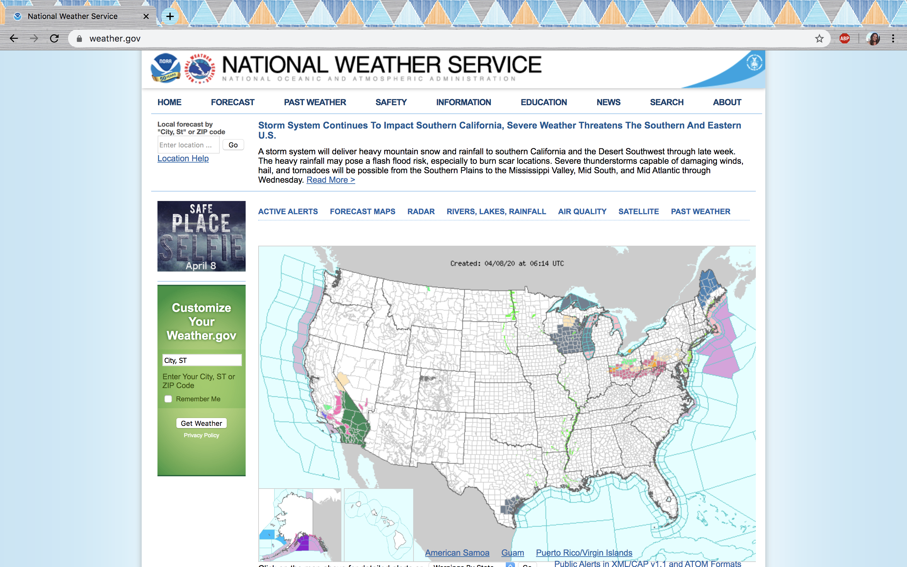

# National Weather Service: Weather.gov

## Emily DiPressi 

 

### Introduction 

### Clear Design Statement 

### Competitor Analysis: Heuristic Evaluation 

### Competitor Analysis: Usability Testing 

### User Research 

### UX Storytelling

### Wireframe and graphic design element variation 

### Low-fidelity Prototype

### High-fidelity Prototype 

### Evaluation and Revision History 

### Pitch Video 

### Conclusion 
